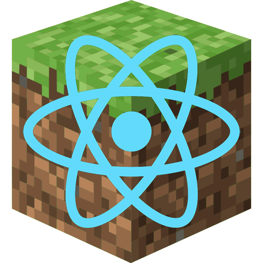

<p align="center"></p>

<h1 align="center">React MCLauncher</h1>

Custom launcher for modded minecraft written in Electron with React.

This launcher is based on [Helios Launcher][helioslauncher] and uses [MCLC][mclc]

## Features

- 📂 Minecraft is automatically downloaded. Files are validated before launch. Corrupt or incorrect files will be redownloaded.
- ☕ Java is automatically downloaded and installed if java is not installed.
- 📰 News feed natively built into the launcher.
- ⚙️ Intuitive settings management
- Automatic updates. That's right, the launcher updates itself.
- And more...

## Development

This section details the setup of a basic developmentment environment.

### Getting Started

**System Requirements**

- [Node.js][nodejs] v14

---

**Clone and Install Dependencies**

```console
> git clone https://github.com/dd060606/ReactMCLauncher.git
> cd ReactMCLauncher
> npm i
```

---

**Launch Application**

```console
> npm start
```

---

**Build Installers**

To build for your current platform.

```console
> npm run build
```

---

### Note on Third-Party Usage

You may use this software in your own project so long as the following conditions are met.

- Credit is expressly given to the original authors (dd_06).
  - Include a link to the original source on the launcher's About page.
  - Credit the authors and provide a link to the original source in any publications or download pages.
- The source code remain **public** as a fork of this repository.

We reserve the right to update these conditions at any time, please check back periodically.

---

#### Like the project? Leave a ⭐ star on the repository!

[nodejs]: https://nodejs.org/en/ "Node.js"
[helioslauncher]: https://github.com/dscalzi/HeliosLauncher "Helios Launcher"
[mclc]: https://github.com/Pierce01/MinecraftLauncher-core "MCLC"
